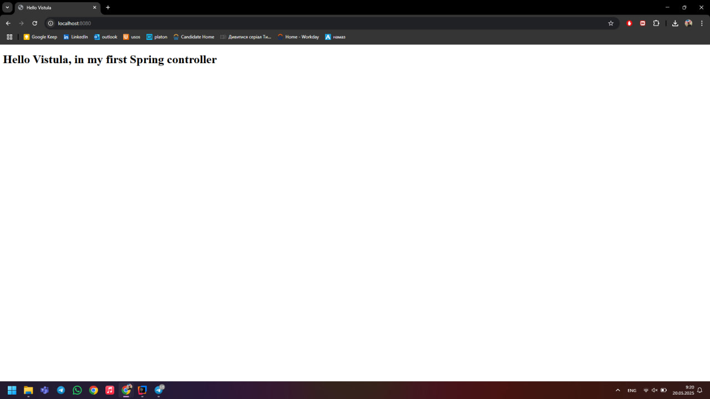
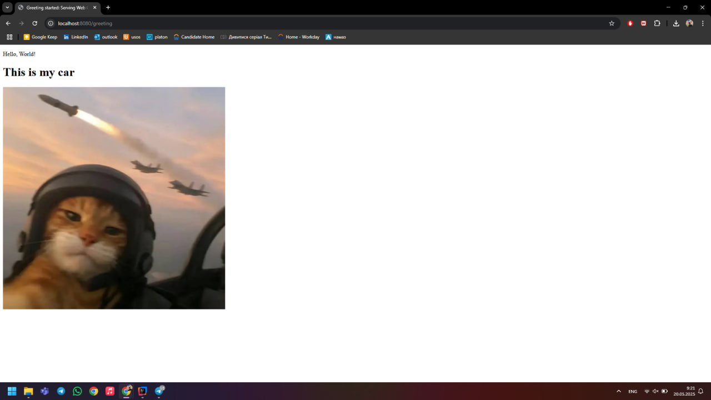

# Vistula Spring Boot Demo Project

This is a simple Spring Boot project created for educational purposes at Vistula.  
It demonstrates how to use controllers, HTML templates, and serve static images with Spring Boot.

---

## Features

- Home page with a custom greeting.
- `/greeting` endpoint that displays a welcome message and a meme image of a cat "pilot".

---

## How It Looks

### Home Page (`/`)



- Shows:  
  **"Hello Vistula, in my first Spring controller"**

---

### Greeting Page (`/greeting`)



- Shows:
    - A message: **Hello, World!**
    - Title: **This is my car**
    - Meme image: Cat in a pilot helmet with jets and rockets.

---

## How to Run

1. **Clone the repository:**
   ```sh
   git clone https://github.com/your-username/your-repo.git
   cd your-repo
